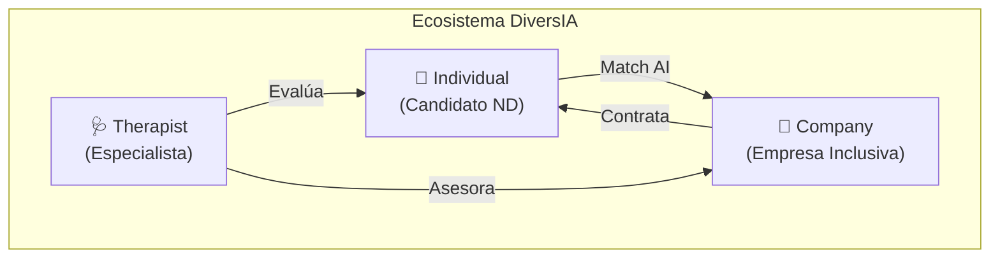
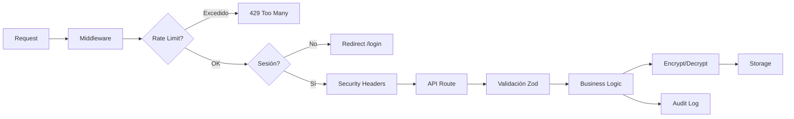
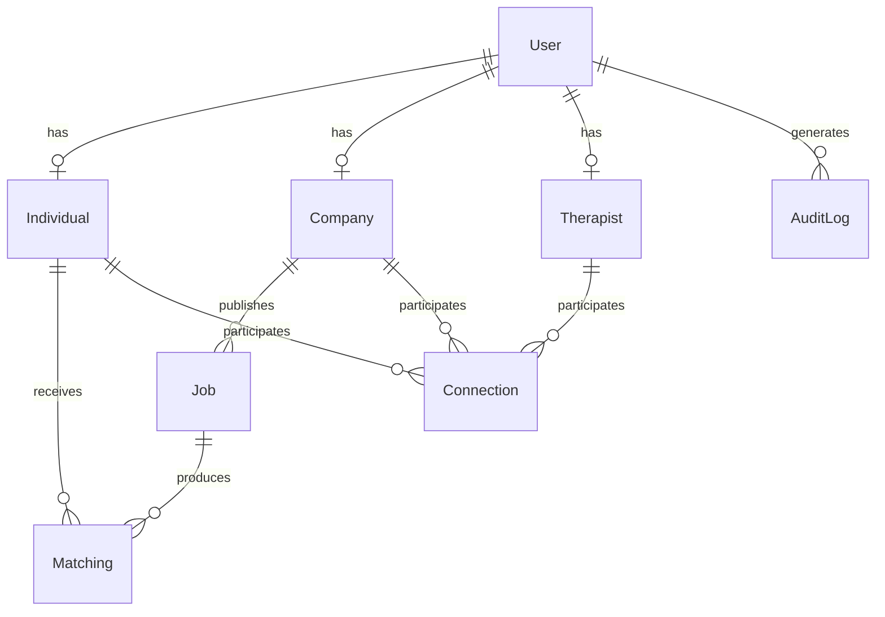

# 🔍 Auditoría Exhaustiva — Diversia Eternals (Talento-Neurodivergente)

**Fecha:** 10 de febrero de 2026  
**Auditor:** Atlas (Meta-Arquitecto)  
**Branch activa:** `feat/auth-admin-ecosystem`  
**Última actividad registrada:** ~26 de enero de 2026

---

## 1. 🎯 Visión del Proyecto

**DiversIA Eternals** es una plataforma para conectar **talento neurodivergente** con **empresas inclusivas**, mediada por **terapeutas especializados**. Utiliza IA para evaluación de fortalezas cognitivas y análisis de inclusividad laboral.

### Modelo de Negocio: 3 Actores



| Actor | Funciones Clave |
|-------|----------------|
| **Individual** | Registro, assessment gamificado, perfil de fortalezas, chat IA |
| **Company** | Publicar jobs, buscar candidatos, training de inclusividad |
| **Therapist** | Evaluar candidatos, crear accommodations, facilitar matching |

---

## 2. 🏗️ Stack Tecnológico

### Core

| Capa | Tecnología | Versión |
|------|-----------|---------|
| **Framework** | Next.js (App Router) | 15.5.9 |
| **Runtime** | React | 19.0.0 |
| **Auth** | NextAuth.js v5 | 5.0.0-beta.30 |
| **Validación** | Zod | 4.3.5 |
| **ORM (futuro)** | Prisma | 5.22.0 |
| **DB (futuro)** | PostgreSQL | — |
| **Styling** | Vanilla CSS + Variables CSS | — |
| **Testing** | Vitest + Testing Library | 4.0.17 |
| **Encriptación** | AES-256-GCM (Node crypto) | nativo |
| **Password Hashing** | bcryptjs | 3.0.3 |
| **Charts** | Recharts | 3.0.2 |
| **Icons** | Lucide React + React Icons | — |
| **LLM (self-hosted)** | Gemma 2B via Ollama | Docker/VPS |

### Dev Tools

| Herramienta | Uso |
|------------|-----|
| **Vitest** | Unit + integration tests |
| **Testing Library** | React component testing |
| **happy-dom / jsdom** | DOM environment para tests |
| **TypeScript** | Tipado (parcial, `tsconfig.json` existe) |
| **Turbopack** | Dev server (`next dev --turbopack`) |

---

## 3. 📁 Arquitectura del Proyecto

### Estructura de Directorios (simplificada)

```
Talento-Neurodivergente/
├── .agent/                    # Sistema de agentes GACE
│   ├── specialists/           # 7 agentes especialistas
│   ├── dispatches/            # Órdenes de despacho históricas
│   ├── workflows/             # Flujos de trabajo (/atlas, /sync)
│   └── current_dispatch.md    # Despacho activo
├── app/                       # Next.js App Router
│   ├── api/                   # 9 dominios de API
│   ├── components/            # ~41 componentes React
│   ├── lib/                   # 18 módulos de lógica de negocio
│   ├── hooks/                 # Custom hooks (useLanguage)
│   ├── utils/                 # Traducciones i18n
│   ├── (dashboard)/           # Route groups: dashboards
│   ├── auth/                  # Flujo de autenticación
│   ├── login/ register/       # Páginas auth
│   ├── games/ quiz/           # Juegos y assessments
│   ├── company/ therapist/    # Dashboards por rol
│   └── globals.css            # Sistema de diseño CSS
├── prisma/                    # Schema DB (PostgreSQL)
│   └── schema.prisma          # 244 líneas, 10 modelos
├── tests/                     # Suite de tests
│   ├── unit/                  # 8 archivos de tests unitarios
│   ├── api/                   # 4 tests de API
│   ├── integration/           # 2 tests de integración
│   ├── lib/                   # 3 tests de librería
│   └── pending/               # 6 tests pendientes
├── docs/                      # Documentación extendida
│   ├── business/              # Materiales de inversión
│   ├── USE_CASES.md           # Casos de uso detallados
│   └── IMPLEMENTATION_*.md    # Estado de implementación
├── data/                      # JSON File Storage (legacy)
├── middleware.js               # Auth + Rate Limiting + Security Headers
└── [12 archivos .md raíz]    # Documentación del proyecto
```

### Módulos de Lógica de Negocio (`app/lib/`)

| Módulo | Líneas | Función |
|--------|--------|---------|
| `therapists.js` | 25,605 B | Gestión completa de terapeutas |
| `consent.js` | 21,303 B | **CRÍTICO** — Consentimiento GDPR |
| `individuals.js` | 20,010 B | Perfiles de candidatos |
| `companies.js` | 18,041 B | Empresas y job postings |
| `matching.js` | 15,585 B | **CORE** — Algoritmo de matching |
| `dashboards.js` | 14,207 B | Métricas por actor |
| `storage.js` | 13,769 B | Capa de persistencia JSON |
| `schemas.js` | 10,988 B | Validación Zod |
| `utils.js` | 7,686 B | Utilidades compartidas |
| `draft-manager.js` | 6,564 B | Guardado de borradores |
| `llm.js` | 5,919 B | Cliente Ollama (Gemma 2B) |
| `rate-limiter.js` | 3,357 B | Rate limiting in-memory |
| `audit.js` | 3,209 B | Logging de auditoría GDPR |
| `encryption.js` | 2,980 B | AES-256-GCM |
| `auth.js` | 2,078 B | Configuración NextAuth |
| `auth.config.js` | 1,993 B | Auth config (Edge-compatible) |
| `auth-redirect.ts` | 901 B | Redirección por rol |
| `prisma.js` | 331 B | Cliente Prisma singleton |

### APIs Implementadas (`app/api/`)

| Dominio | Endpoints |
|---------|-----------|
| `auth/` | NextAuth handler (`[...nextauth]`) |
| `individuals/` | CRUD + `[userId]` + privacy |
| `companies/` | CRUD + `[companyId]` + jobs |
| `therapists/` | (en progreso) |
| `matching/` | Cálculo y gestión de matches |
| `consent/` | Gestión de consentimiento |
| `dashboards/` | Datos de dashboards por rol |
| `forms/` | Formulario genérico legacy |
| `chat/` | NeuroAgent chatbot |
| `health/` | Health check |

---

## 4. 🧩 Patrones de Diseño Identificados

### Arquitectura

| Patrón | Dónde | Descripción |
|--------|-------|-------------|
| **App Router (Next.js)** | Todo el proyecto | File-based routing con RSC |
| **Route Groups** | `(dashboard)/`, `(public)/` | Agrupación lógica sin afectar URL |
| **API Routes Serverless** | `app/api/` | Cada endpoint es un handler independiente |
| **Service Layer** | `app/lib/*.js` | Lógica de negocio separada de las API routes |
| **JSON File Storage** | `app/lib/storage.js` | Persistencia sin DB (MVP) |
| **Privacy-First** | Todos los módulos | Privacidad integrada desde el core |
| **Consent-Based Access** | `consent.js` | Sin consentimiento = sin datos |

### Componentes React

| Patrón | Ejemplo |
|--------|---------|
| **Component Composition** | `Home.js` orquesta 10+ componentes |
| **Container Pattern** | `GameContainer.js` maneja lógica de juegos |
| **Custom Hook** | `useLanguage()` para i18n |
| **Factory Pattern** | `GenericForm.js` genera 3 tipos de formularios |
| **Observer Pattern** | Evento `languageChanged` para sincronizar idioma |
| **Strategy Pattern** | Validadores diferentes por tipo de formulario |

### Seguridad

| Patrón | Implementación |
|--------|---------------|
| **Zero Trust** | Middleware verifica sesión en cada request |
| **Encryption at Rest** | AES-256-GCM para datos médicos |
| **RBAC** | 4 roles: individual, company, therapist, admin |
| **Rate Limiting** | In-memory con presets AUTH/READ/WRITE/API |
| **Security Headers** | X-Frame-Options, X-XSS-Protection, etc. |
| **Input Validation** | Zod schemas en todos los endpoints |
| **Audit Logging** | 7 años de retención (GDPR) |

### Desarrollo

| Patrón | Descripción |
|--------|-------------|
| **TDD (Red→Green→Refactor)** | Metodología declarada, parcialmente aplicada |
| **GACE Agent System** | 7 agentes especialistas con system prompts |
| **Dispatch Protocol** | Órdenes formales para tareas complejas |
| **Conventional Commits** | Historial de commits con prefijos (feat, fix, docs, chore) |

---

## 5. 🔒 Modelo de Seguridad y Compliance

### Compliance Targets

| Regulación | Estado | Detalles |
|-----------|--------|----------|
| **GDPR** | ✅ Parcial | Encriptación, consentimiento, audit logs |
| **HIPAA** | ✅ Parcial | Datos médicos encriptados |
| **EU AI Act** | 🟡 En progreso | Schema Prisma con `aiFactors`, `aiExplanation` |
| **OWASP Top 10** | ✅ Parcial | Input validation, auth, security headers |

### Flujo de Seguridad



---

## 6. 🗄️ Modelo de Datos

### Estado Actual: Dual (JSON → PostgreSQL)

El proyecto opera **actualmente en JSON File Storage** pero tiene un **Prisma schema diseñado** para migrar a PostgreSQL.

### Prisma Schema (Futuro)



**10 modelos**: `User`, `Individual`, `Company`, `Therapist`, `Job`, `Matching`, `Connection`, `AuditLog` + 4 enums (`UserType`, `JobStatus`, `MatchingStatus`, `AuditEventType`, `ConnectionType`)

**SaaS-Ready**: `Company` incluye `subscriptionPlan` y `stripeCustomerId`

---

## 7. 🧪 Estado de Testing

### Configuración

- **Framework:** Vitest 4.0.17
- **Environment:** jsdom
- **Setup:** `tests/setup.js`
- **Aliases:** `@` → `app/`, `@lib`, `@components`, `@utils`, `@hooks`
- **Ejecutar:** `npm test`

### Cobertura Reportada (según docs, enero 2026)

| Suite | Tests | Estado |
|-------|-------|--------|
| Encryption | 11 | ✅ 100% |
| Storage | 10 | ✅ 100% |
| Individual registration | 20 | ✅ 100% |
| Company tests | 16/26 | 🟡 62% |
| Draft Mode | 8 | ✅ 100% |
| API tests | 72-73 | ✅ 100% |
| **Total reportado** | ~116-180 | **Parcial** |

> [!WARNING]
> Los números de tests varían entre documentos (`TODO.md` dice 116, `SECURITY_IMPLEMENTATION.md` dice 180). Se necesita ejecutar `npm test` para obtener el estado real actual.

---

## 8. 🤖 Sistema de Agentes GACE

### Jerarquía

| # | Agente | Rol |
|---|--------|-----|
| 00 | **GACE Architect** | Meta-Orquestador, decisiones arquitectónicas |
| 01 | **Security** | Compliance, GDPR, encriptación |
| 02 | **Tech Stack** | Infraestructura, DevOps, estructura |
| 03 | **Backend Agent** | API, lógica de negocio, storage |
| 04 | **Frontend Agent** | UI/UX, componentes React, accesibilidad |
| 05 | **Game Agent** | Gamificación, juegos cognitivos |
| 08 | **Testing Agent** | QA, estrategia de pruebas |

### Protocolo de Despacho
Las tareas complejas se asignan via **Órdenes de Despacho** formales con: destinatario, contexto, restricciones de seguridad/testing, y criterios de éxito.

---

## 9. 🌿 Estado de Git

### Branches

| Branch | Propósito | Estado |
|--------|-----------|--------|
| `main` | Producción | ✅ Activa |
| `develop` | Integración | ✅ Activa |
| `feat/auth-admin-ecosystem` | **ACTUAL** — Auth + admin | 🔄 En progreso |
| `feature/pep/dashboard-improvements` | Mejoras dashboard | 🟡 En progreso |
| `archive/pre-cleanup-20260122` | Backup pre-limpieza | 📦 Archivo |

### Últimos Commits Significativos

- `feat: implement auth flow & role-based navigation`
- `feat: implementar UC-009 Therapist Dashboard with Clients`
- `feat: implementar UC-008 Therapist Registration`
- `feat: sistema de seguridad enterprise-grade - encriptación, auth y autorización`

---

## 10. 📊 Estado General y Deuda Técnica

### Resumen de Completitud

| Área | Estado | Completitud |
|------|--------|-------------|
| **Frontend (landing, forms, games, quiz)** | ✅ Funcional | ~85% |
| **Autenticación** | ✅ Implementado | ~80% |
| **Autorización (RBAC)** | ✅ Parcial | ~70% |
| **Seguridad (encriptación, headers, rate limiting)** | ✅ Implementado | ~80% |
| **Lógica de Negocio (lib/)** | 🟡 Parcial | ~60-70% |
| **Base de Datos (Prisma/PostgreSQL)** | 🔴 Solo schema | ~15% |
| **Testing** | 🟡 Parcial | ~50% |
| **Integración LLM (Ollama)** | 🟡 Cliente creado | ~40% |
| **E2E Tests** | 🔴 No iniciados | 0% |
| **CI/CD** | 🔴 No configurado | 0% |
| **Deploy producción** | 🔴 No realizado | 0% |

### Deuda Técnica Crítica

1. **~70 archivos `tmpclaude-*` basura** en `app/` y `app/api/` — necesitan limpieza
2. **JSON File Storage** — sin transacciones, race conditions, no escalable
3. **Migración a PostgreSQL** pendiente (schema Prisma diseñado pero no ejecutado)
4. **Tests inconsistentes** — números diferentes en cada documento
5. **Chat API usa pattern matching** en lugar de LLM real
6. **TypeScript parcial** — `tsconfig.json` existe pero la mayoría del código es `.js`

### Issues Resueltos (del `CRITICAL_ISSUES.md`)

- [x] Autenticación implementada (NextAuth v5)
- [x] Encriptación de datos sensibles (AES-256-GCM)
- [x] Rate limiting implementado
- [x] Input sanitization (DOMPurify)
- [x] Tests básicos escritos
- [x] Security headers en middleware

### Issues Pendientes

- [ ] Race conditions en storage
- [ ] Ocultar errores internos en producción
- [ ] Transacciones/WAL para operaciones multi-archivo
- [ ] Índices de búsqueda eficientes
- [ ] E2E tests con Playwright
- [ ] CI/CD pipeline
- [ ] Migración a PostgreSQL

---

## 11. 📚 Mapa de Documentación

| Archivo | Contenido | Tamaño |
|---------|-----------|--------|
| [README.md](file:///c:/Users/Josep/Talento-Neurodivergente/README.md) | Documentación pública del proyecto | 7.7 KB |
| [DOCUMENTACION_PROYECTO.md](file:///c:/Users/Josep/Talento-Neurodivergente/DOCUMENTACION_PROYECTO.md) | **Biblia del proyecto** — arquitectura, APIs, modelos, i18n | 62 KB |
| [SECURITY_IMPLEMENTATION.md](file:///c:/Users/Josep/Talento-Neurodivergente/SECURITY_IMPLEMENTATION.md) | Sistema de seguridad completo + LLM compliance | 20.6 KB |
| [DOCUMENTO_PRAG.md](file:///c:/Users/Josep/Talento-Neurodivergente/DOCUMENTO_PRAG.md) | Plan maestro pre-inversión ($400K BA) | 33.7 KB |
| [CRITICAL_ISSUES.md](file:///c:/Users/Josep/Talento-Neurodivergente/CRITICAL_ISSUES.md) | Issues de seguridad (mayoría resueltos) | 15 KB |
| [TODO.md](file:///c:/Users/Josep/Talento-Neurodivergente/TODO.md) | Features pendientes (OpenAI integration) | 9 KB |
| [PROJECT_STATUS.md](file:///c:/Users/Josep/Talento-Neurodivergente/PROJECT_STATUS.md) | Estado de branches y features | 3 KB |
| [CHANGELOG.md](file:///c:/Users/Josep/Talento-Neurodivergente/CHANGELOG.md) | Historial de versiones | 20.4 KB |
| [docs/IMPLEMENTATION_STATUS.md](file:///c:/Users/Josep/Talento-Neurodivergente/docs/IMPLEMENTATION_STATUS.md) | Estado detallado de cada módulo lib/ | 18 KB |
| [docs/USE_CASES.md](file:///c:/Users/Josep/Talento-Neurodivergente/docs/USE_CASES.md) | Casos de uso detallados | 37 KB |
| [docs/business/](file:///c:/Users/Josep/Talento-Neurodivergente/docs/business) | One-pager, email templates, demo script | 5 archivos |

---

## 12. 🗺️ Ruta de Estudio Recomendada

Para entender las decisiones del proyecto, estudia en este orden:

### Fase 1: Fundamentos (Día 1)
1. **[README.md](file:///c:/Users/Josep/Talento-Neurodivergente/README.md)** — Visión general rápida
2. **[DOCUMENTACION_PROYECTO.md](file:///c:/Users/Josep/Talento-Neurodivergente/DOCUMENTACION_PROYECTO.md)** (secciones 1-5) — Negocio + Arquitectura
3. **[package.json](file:///c:/Users/Josep/Talento-Neurodivergente/package.json)** — Stack tecnológico exacto

### Fase 2: Seguridad y Compliance (Día 2)
4. **[SECURITY_IMPLEMENTATION.md](file:///c:/Users/Josep/Talento-Neurodivergente/SECURITY_IMPLEMENTATION.md)** — Modelo de seguridad completo
5. **[middleware.js](file:///c:/Users/Josep/Talento-Neurodivergente/middleware.js)** — Cómo se aplica la seguridad
6. **[CRITICAL_ISSUES.md](file:///c:/Users/Josep/Talento-Neurodivergente/CRITICAL_ISSUES.md)** — Qué se detectó y qué se resolvió

### Fase 3: Modelo de Datos y Negocio (Día 3)
7. **[prisma/schema.prisma](file:///c:/Users/Josep/Talento-Neurodivergente/prisma/schema.prisma)** — Modelo de datos futuro
8. **[docs/IMPLEMENTATION_STATUS.md](file:///c:/Users/Josep/Talento-Neurodivergente/docs/IMPLEMENTATION_STATUS.md)** — Estado real de cada módulo
9. **[docs/USE_CASES.md](file:///c:/Users/Josep/Talento-Neurodivergente/docs/USE_CASES.md)** — Flujos de usuario completos

### Fase 4: Estrategia y Roadmap (Día 4)
10. **[TODO.md](file:///c:/Users/Josep/Talento-Neurodivergente/TODO.md)** — Features pendientes
11. **[DOCUMENTO_PRAG.md](file:///c:/Users/Josep/Talento-Neurodivergente/DOCUMENTO_PRAG.md)** — Plan de inversión
12. **[Agent.md](file:///c:/Users/Josep/Talento-Neurodivergente/Agent.md)** — Metodología GACE completa

### Fase 5: Código Fuente (Día 5+)
13. **`app/lib/`** — Empezar por `matching.js` (core business), luego `consent.js` (GDPR), luego `individuals.js`
14. **`app/api/`** — Empezar por `individuals/[userId]/route.js` (modelo de autorización)
15. **`tests/`** — Revisar tests existentes para entender el flujo TDD

---

> [!IMPORTANT]
> **Decisión arquitectónica clave pendiente:** La migración de **JSON File Storage → PostgreSQL (Prisma)** es el siguiente paso más importante. El schema está diseñado (`prisma/schema.prisma`) pero no se ha ejecutado la migración. Todo el código actual usa `app/lib/storage.js` con archivos JSON, lo cual no es viable para producción.
